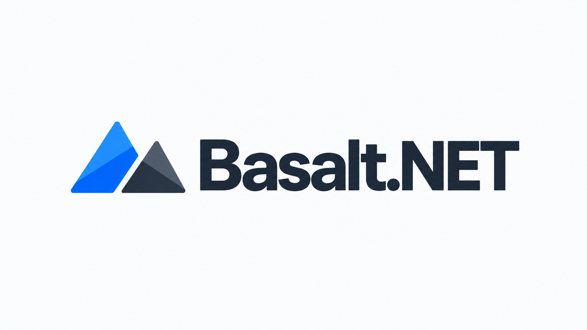

# Basalt.NET

<p align="center">
  
</p>

**Durable background jobs for .NET -- embedded when local, SQL Server when shared.**

[](https://github.com/Vanderhell/Basalt.NET/actions/workflows/ci.yml)


Basalt.NET is a lightweight durable job, scheduling, and static-workflow engine for .NET applications. Run it inside an application with embedded storage, or let multiple processes share the same queue through SQL Server -- with the same managed API.

No separate job server is required.

## Quick start

```csharp
using BasaltCore;

using var basalt = Basalt.Embedded(@"C:\data\jobs");

basalt.On<SendInvoice>("billing.send", async (job, context, ct) =>
    await SendInvoiceAsync(job, ct));

await basalt.StartAsync();

await basalt.EnqueueAsync(
    new SendInvoice(123),
    key: "invoice:123",
    retry: 5);

await basalt.StopAsync();
```

Need a shared queue instead?

```csharp
using BasaltCore;
using BasaltCore.SqlServer;

using var basalt = Basalt.SqlServer(connectionString);
```

The handler and job code stays the same.

## What Basalt gives you

- Durable, strongly typed background jobs
- Retry and idempotency
- Delayed, interval, daily, and cron scheduling
- Static DAG workflows
- Crash recovery, leases, and fencing
- Multi-process coordination
- Embedded local storage or shared SQL Server storage
- .NET 8 and .NET Framework 4.7.2 / WPF support

## Scheduling

```csharp
await basalt.EveryAsync(
    "sync",
    TimeSpan.FromMinutes(5),
    new SyncJob());
```

For cron, timezone, overlap, and misfire policies, use the scheduler builder:

```csharp
await basalt.ScheduleAsync(
    "nightly",
    new BackupJob(),
    schedule => schedule
        .Cron("0 2 * * *")
        .InTimeZone("Central Europe Standard Time")
        .OnOverlap(OverlapPolicy.Skip));
```

## Workflows

```csharp
await basalt.Workflow("invoice")
    .Add("create", new CreateInvoice())
    .Then("send", new SendInvoice())
    .Then("notify", new NotifyCustomer())
    .SubmitAsync();
```

Workflows are static durable DAGs. Explicit dependencies and dependency-failure policies are also supported.

## Dashboard and management

`BasaltDashboard` is a separate WPF management console for health, queue state, executions, failures, schedules, workflows, workers, and cumulative statistics. It uses the same storage-neutral public Basalt API, never Embedded files or SQL Server tables directly.

> Dashboard preview placeholder — the included console is intentionally shipped as source so it can be opened against an application's Embedded directory or SQL Server schema.

```text
dotnet run --project BasaltDashboard -- C:\data\jobs
dotnet run --project BasaltDashboard -- --sql "<connection string>"
```

See [Management and monitoring](docs/management-monitoring.md) for the health, queue, filtering, and lifecycle APIs.

## Embedded or SQL Server?

### Embedded

Use Embedded when Basalt runs in one application or on one machine. It needs only an application-owned writable directory.

```csharp
using var basalt = Basalt.Embedded(@"C:\data\jobs");
```

### SQL Server

Use SQL Server when multiple application instances or machines must share durable work. Basalt owns objects only in its configurable schema inside the existing database.

```csharp
using var basalt = Basalt.SqlServer(connectionString, sql =>
{
    sql.Schema = "MyApp_Basalt";
    sql.SchemaManagement = SchemaManagement.ValidateOnly;
});
```

SQL storage is not a worker service: every process that executes jobs registers handlers and calls `StartAsync`.

## Durability model

Basalt provides **at-least-once execution**. A successful enqueue means the job was durably accepted, not that its handler has completed. Handlers that produce external side effects must be idempotent or use appropriate fencing and idempotency controls.

## Documentation

- [Getting started](docs/getting-started.md)
- [API reference](docs/api.md)
- [Cookbook](docs/cookbook.md)
- [Durability](docs/durability.md)
- [SQL Server](docs/sql-server.md)
- [Storage](docs/storage.md)
- [Architecture](docs/architecture.md)
- [Management and monitoring](docs/management-monitoring.md)

## Contributing

Contributions and bug reports are welcome. Read [CONTRIBUTING.md](CONTRIBUTING.md) before opening a pull request. Security reports follow [SECURITY.md](SECURITY.md).

## License

MIT License - Copyright 2026 Vanderhell. See [LICENSE](LICENSE).
